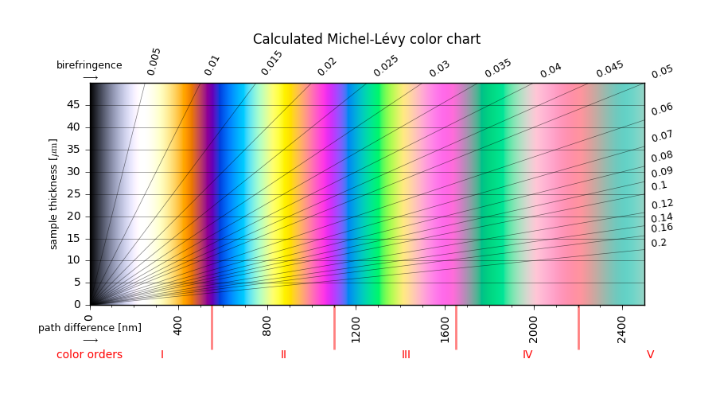
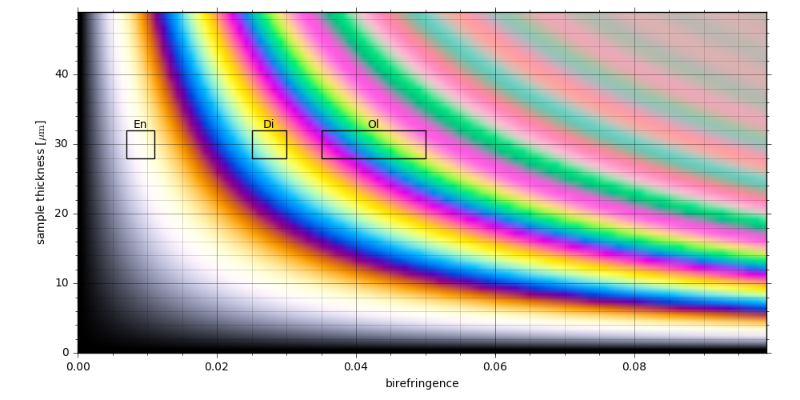

# Calculation and plotting of the Michel-Lévy color chart

These Ipython/Jupyter-notebooks show how to calculate and plot the Michel-Lévy color chart using python.
The chart is used to identify minerals in petrographic thin sections. It correlates the interference colors, visible in the microscope, with the thickness an birefringence of the mineral thin section. 

This code is based on:
~~~
"A revised Michel-Lévy interference colour chart based on first-principles calculations"
Sørensen, Bjørn Eske

European Journal of Mineralogy, 2013, 25. Jg., Nr. 1, S. 5-10
~~~

The article is open access, so please read it if you're interested (http://eurjmin.geoscienceworld.org/content/25/1/5). The matlab-implementation by the original author can be found here: https://www.researchgate.net/profile/Bjorn_Sorensen/publications.

All credit goes to Mr. Sørensen, I'm not affiliated in any way. I just found his work, implemented it in python and made the chart with matplotlib. The goal was to reproduce the results of the article and make them accessible and usable without a matlab license.

- Notebook 1/2 explains the calculation and shows how to generate the chart.

- Notebook 2/2 shows some more applications.

# Dependencies
- python 3
- jupyter notebook
- numpy
- matplotlib

# How to install python from scratch
The installation of python 3 with th "Anaconda" distribution installation is straight forward and platform independent:
- Download Anaconda python at https://www.continuum.io/downloads
- If not already installed, install the necessary packages:
~~~
conda install numpy
conda install notebook
conda install matplotlib
~~~
- running the notebook:
~~~
jupyter notebook
~~~
